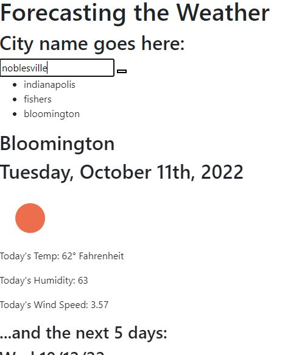

# Weather Dashboard
Module 6 Challenge: Server-Side APIs

## Live Link
https://blakerichardburns.github.io/weather-dashboard/

## Repository Link
https://github.com/blakerichardburns/weather-dashboard

## Description
This app will allow the user to input a city name, and a five day weather forecast will pull from a separate weather applications API and display using dynamically updated HTML and CSS.

## Table of Contents
  * [Installation Instructions](#installation-instructions)
  * [Usage Information](#usage-information)
  * [Questions](#questions)

  ## Installation Instructions
  N/A

  ## Usage Information
  N/A
  
  ## Questions
  For any inquiries, spam by inbox here: blakerichardburns@gmail.com
  To peruse more of my portfolio, check this out: [blakerichardburns](https://github.com/blakerichardburns)